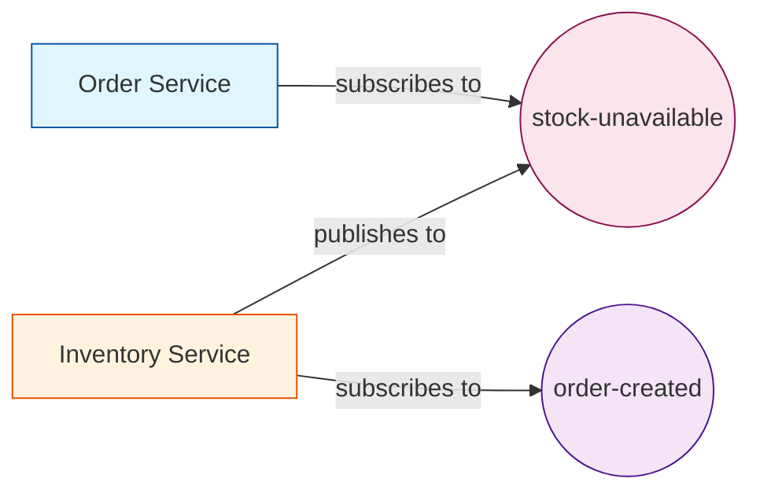

# Async API Playground

A microservices project demonstrating event-driven architecture with:
- Sping Cloud Stream Kafka Binder
- Springwolf for AsyncAPI documentation
- JSON-based event payloads

## Architecture



## Services

### Order Service <sub><sup>Port 8081</sup></sub>
- Listens to `stock-unavailable` topic
- Action: Cancels orders when stock is unavailable

### Inventory Service <sub><sup>Port 8082</sup></sub>
- Listens to `order-created` topic
- Action: Validates stock availability and publishes `stock-unavailable` events when needed

### Running Everything with Docker

Build and start all services (Kafka, Kafka UI, Order Service, Inventory Service):

```bash
docker-compose up --build -d
```

### Access the UIs

- **Kafka UI**: http://localhost:3000
- **Order Service AsyncAPI**: http://localhost:8081/springwolf/asyncapi-ui.html
- **Inventory Service AsyncAPI**: http://localhost:8082/springwolf/asyncapi-ui.html

### Testing the Flow

1. Open Inventory Service AsyncAPI UI at http://localhost:8082/springwolf/asyncapi-ui.html
2. Publish a test message to the `order-created` topic:

```json
{
  "orderId": "ORDER-001",
  "items": {
    "sku-100": 50,
    "sku-200": 150
  }
}
```

3. Check the logs to see the inventory service processing the order
4. If stock is insufficient, a `stock-unavailable` event will be published
5. The order service will receive it and cancel the order

